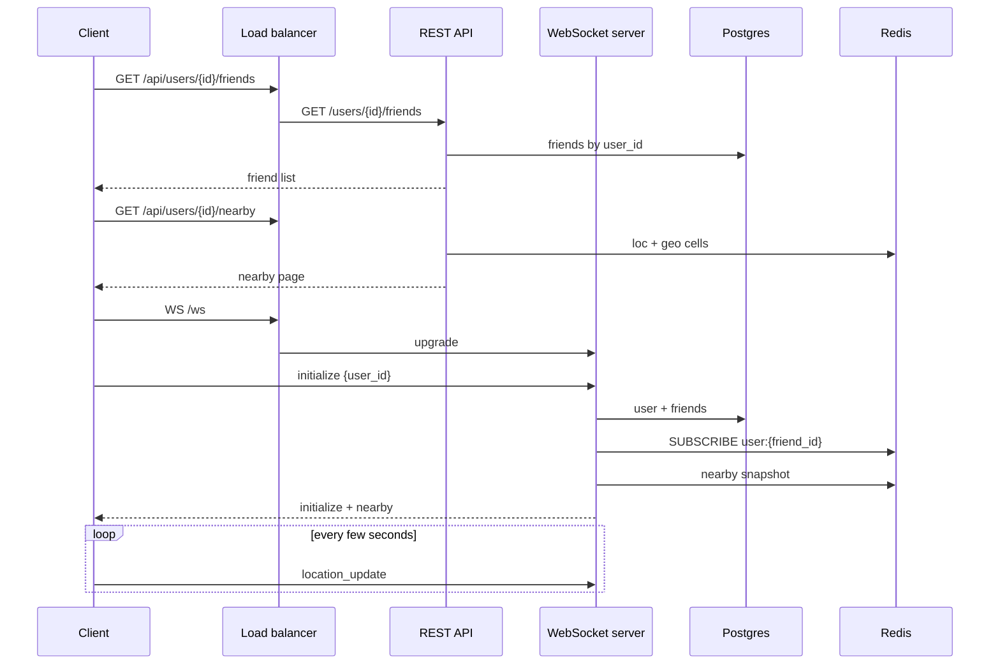
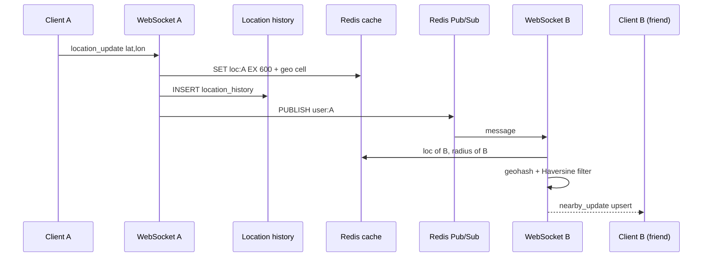
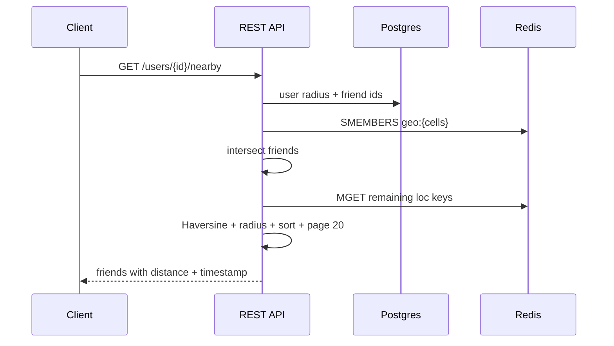
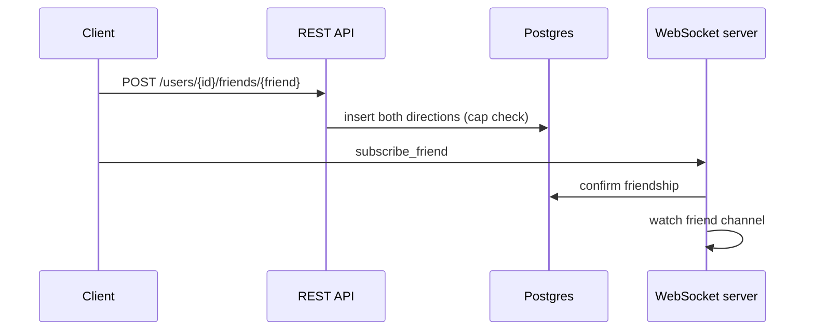

# Sequence diagrams

## 1. Client initialization



## 2. Periodic location update



## 3. Nearby friend discovery



## 4. Add friend



## 5. Remove friend

```mermaid
sequenceDiagram
    participant C as Client
    participant API as REST API
    participant PG as Postgres
    participant WS as WebSocket server

    C->>API: DELETE /users/{id}/friends/{friend}
    API->>PG: delete both directions
    C->>WS: unsubscribe_friend
    WS->>WS: drop watch; UNSUBSCRIBE if last local watcher
    Note over C: No further location events for that pair
```

## 6. WebSocket reconnection

```mermaid
sequenceDiagram
    participant C as Client
    participant WS as WebSocket server

    C--xWS: disconnect
    C->>C: show disconnected; backoff
    C->>WS: new socket
    C->>WS: initialize
    WS-->>C: snapshot nearby
    C->>C: resume location_update; keep last marker until first ok
```

## 7. Failure handling

```mermaid
sequenceDiagram
    participant C as Client
    participant API as REST API
    participant R as Redis
    participant WS as WebSocket

    C->>API: GET /nearby
    API->>R: GET
    R-->>API: timeout
    API-->>C: 500 / degraded metrics
    C->>C: keep last list; show Redis warning
    C--xWS: socket error
    C->>C: reconnect loop; status=connecting
```
